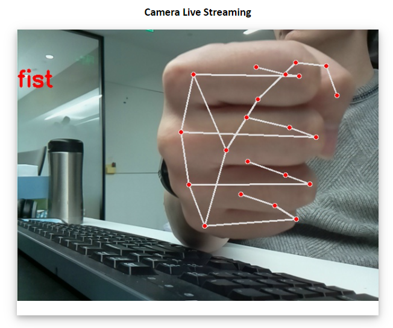
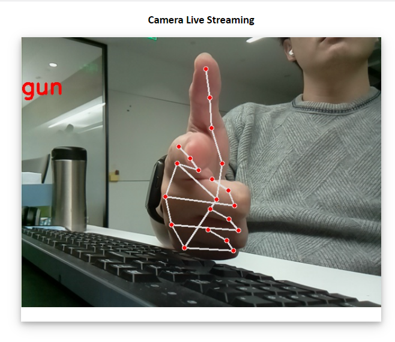

## hand recognition on raspberry pi 4B 64 bit
 Code is refered from https://blog.csdn.net/weixin_45930948/article/details/115444916
 
 ### pre-requirement
 1. camera has enabled on raspberry pi
 2. docker has installed
 e.g.
```
docker build -t zhlhahaha/hand_recog:aarch64 .
docker run --rm --network=host --privileged zhlhahaha/hand_recog:aarch64
```
 Then you can open web brower to see the camera captured hand regesture.
 
 


## You can also use this to trigger a edge device by sending mqtt message
 the mosquitto must runned on the machine, you can refer to https://www.zigbee2mqtt.io/guide/getting-started/#installation
 Environmental Variable
 BROKERIP is the ip of broker
 TOPIC is the topic to send
 In this demo, we can use Fist gesture to turn off a Smart Switch, and Gun gesture
 to turn on
```
docker build -f Dockerfile.mqtt -t zhlhahaha/hand_recog_mqtt:aarch64 .
docker run --rm --network=host --privileged zhlhahaha/hand_recog_mqtt:aarch64
```
